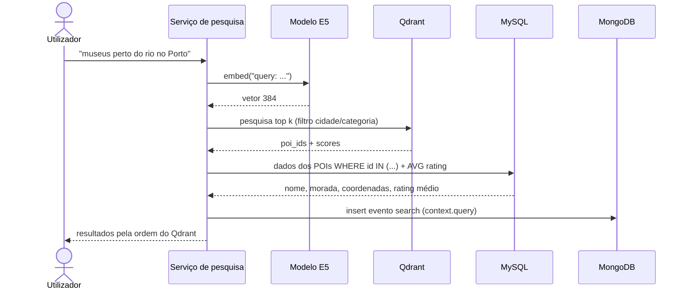
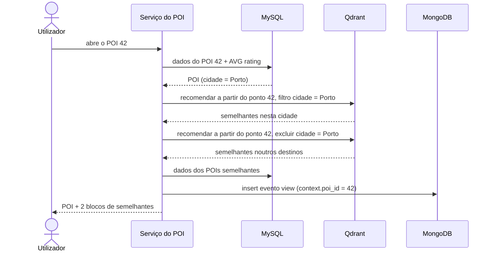
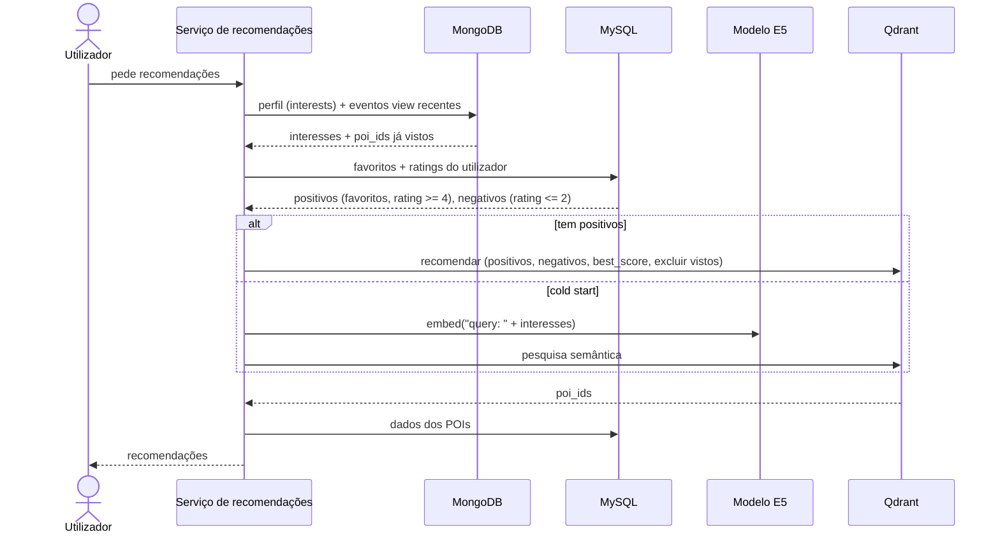

# Arquitetura da aplicação

```mermaid
flowchart TB
    U([Utilizador]) --> UI[Interface da aplicação]
    UI --> S

    subgraph S[Camada de serviços - Python]
        S1[Pesquisa semântica]
        S2[Página do POI<br/>locais semelhantes]
        S3[Recomendações<br/>personalizadas]
        S4[Utilizadores, favoritos,<br/>ratings, proximidade]
    end

    E[Modelo de embeddings<br/>multilingual-e5-small]
    S1 --> E
    S3 --> E

    S --> R
    subgraph R[Camada de repositórios]
        R1[Repositório MySQL]
        R2[Repositório MongoDB<br/>PyMongo]
        R3[Repositório Qdrant<br/>qdrant-client]
    end

    R1 --> M[(MySQL<br/>dados estruturados<br/>fonte de verdade)]
    R2 --> G[(MongoDB<br/>preferências e histórico)]
    R3 --> Q[(Qdrant<br/>vetores dos POIs<br/>cópia derivada)]

    I[Script de indexação] -->|lê POIs| M
    I --> E
    I -->|upsert| Q
```
## Fluxo 1: pesquisa em linguagem natural

```mermaid
sequenceDiagram
    actor U as Utilizador
    participant S as Serviço de pesquisa
    participant E as Modelo E5
    participant Q as Qdrant
    participant M as MySQL
    participant G as MongoDB
    U->>S: "museus perto do rio no Porto"
    S->>E: embed("query: ...")
    E-->>S: vetor 384
    S->>Q: pesquisa top k (filtro cidade/categoria)
    Q-->>S: poi_ids + scores
    S->>M: dados dos POIs WHERE id IN (...) + AVG rating
    M-->>S: nome, morada, coordenadas, rating médio
    S->>G: insert evento search (context.query)
    S-->>U: resultados pela ordem do Qdrant
```

## Fluxo 2: página do POI com locais semelhantes

```mermaid
sequenceDiagram
    actor U as Utilizador
    participant S as Serviço do POI
    participant M as MySQL
    participant Q as Qdrant
    participant G as MongoDB
    U->>S: abre o POI 42
    S->>M: dados do POI 42 + AVG rating
    M-->>S: POI (cidade = Porto)
    S->>Q: recomendar a partir do ponto 42, filtro cidade = Porto
    Q-->>S: semelhantes nesta cidade
    S->>Q: recomendar a partir do ponto 42, excluir cidade = Porto
    Q-->>S: semelhantes noutros destinos
    S->>M: dados dos POIs semelhantes
    S->>G: insert evento view (context.poi_id = 42)
    S-->>U: POI + 2 blocos de semelhantes
```

## Fluxo 3: recomendações personalizadas

```mermaid
sequenceDiagram
    actor U as Utilizador
    participant S as Serviço de recomendações
    participant G as MongoDB
    participant M as MySQL
    participant E as Modelo E5
    participant Q as Qdrant
    U->>S: pede recomendações
    S->>G: perfil (interests) + eventos view recentes
    G-->>S: interesses + poi_ids já vistos
    S->>M: favoritos + ratings do utilizador
    M-->>S: positivos (favoritos, rating >= 4), negativos (rating <= 2)
    alt tem positivos
        S->>Q: recomendar (positivos, negativos, best_score, excluir vistos)
    else cold start
        S->>E: embed("query: " + interesses)
        S->>Q: pesquisa semântica
    end
    Q-->>S: poi_ids
    S->>M: dados dos POIs
    S-->>U: recomendações
```