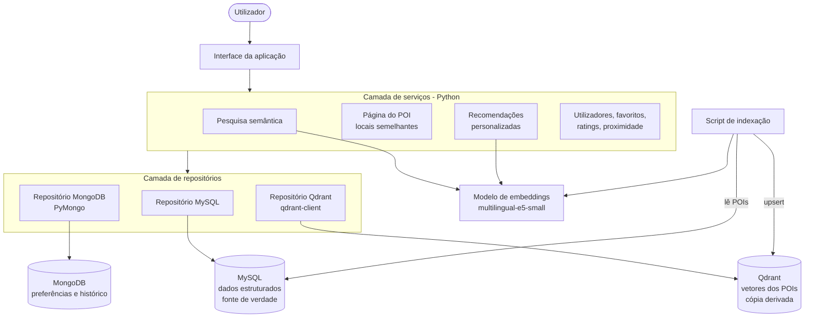

# Arquitetura da aplicação

```mermaid
flowchart TB
    U([Utilizador]) --> UI[Interface da aplicação]
    UI --> S

    subgraph S[Camada de serviços - Python]
        S1[Pesquisa semântica]
        S2[Página do POI<br/>locais semelhantes]
        S3[Recomendações<br/>personalizadas]
        S4[Utilizadores, favoritos,<br/>ratings, proximidade]
    end

    E[Modelo de embeddings<br/>multilingual-e5-small]
    S1 --> E
    S3 --> E

    S --> R
    subgraph R[Camada de repositórios]
        R1[Repositório MySQL]
        R2[Repositório MongoDB<br/>PyMongo]
        R3[Repositório Qdrant<br/>qdrant-client]
    end

    R1 --> M[(MySQL<br/>dados estruturados<br/>fonte de verdade)]
    R2 --> G[(MongoDB<br/>preferências e histórico)]
    R3 --> Q[(Qdrant<br/>vetores dos POIs<br/>cópia derivada)]

    I[Script de indexação] -->|lê POIs| M
    I --> E
    I -->|upsert| Q
```